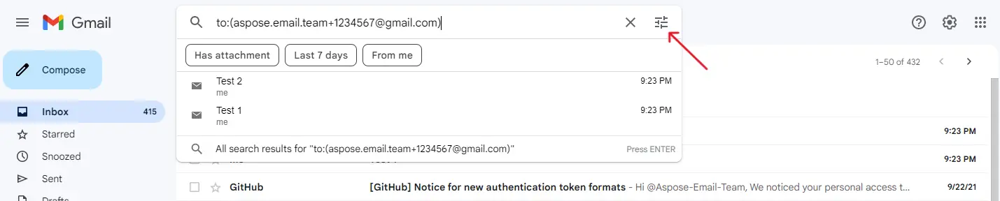
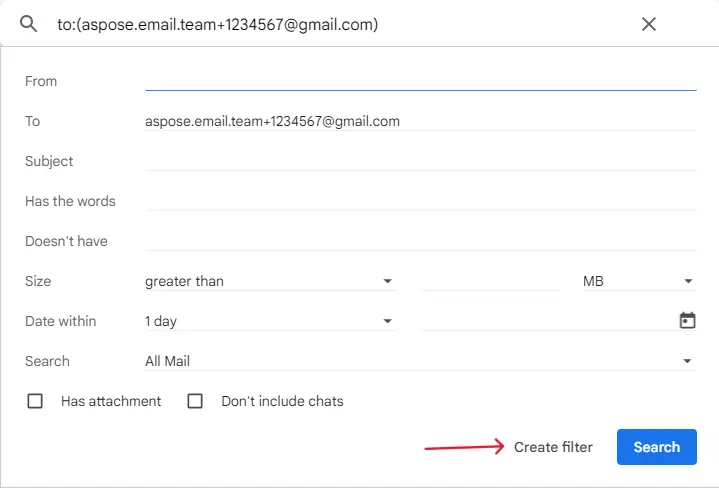
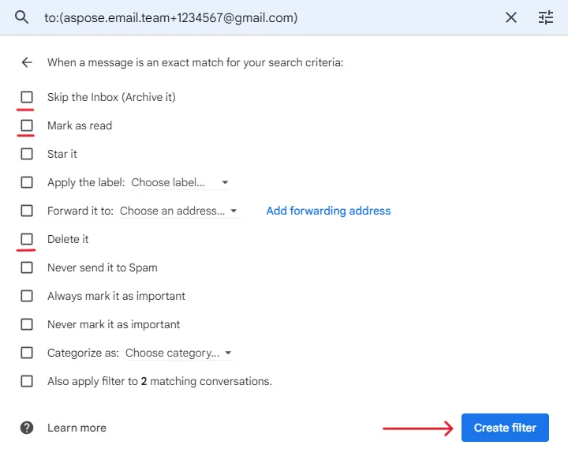
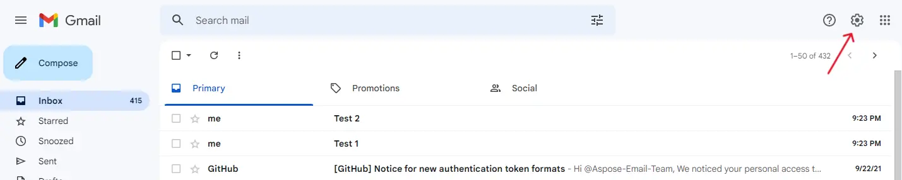
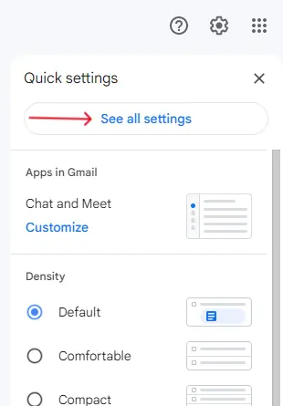
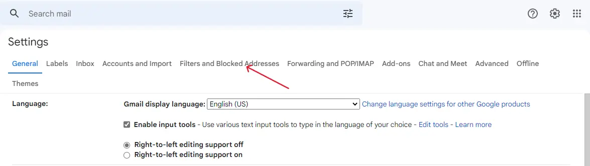
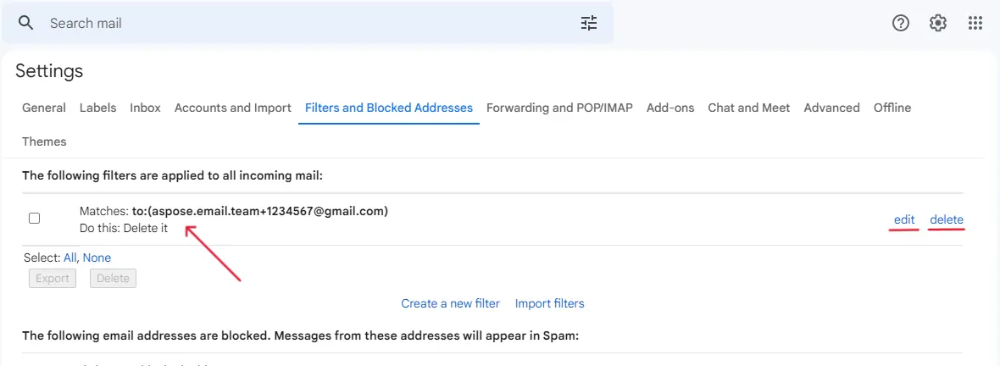






{{< blocks/products/pf/sub-menu autoGeneratedVersion="true" logoImageSrc="https://www.aspose.cloud/templates/aspose/img/products/email/aspose_email-for-net.svg" liveDemosLink="https://products.aspose.app/email/gmail-generator" codeSamplesLink="https://github.com/aspose-email/Aspose.Email-for-.NET" buyLink="https://purchase.aspose.com/buy" docsLink="https://docs.aspose.com/email/net/" nugetLink="https://www.nuget.org/packages/Aspose.Email/" nugetPackageName="Aspose.Email" mavenRepoLink="" directDownloadLink="https://downloads.aspose.com/email/net" >}}

{}

Gmail generator is a fairly common way to manage email subscriptions. In essence, this is an analogue of a provider of temporary email addresses, but much more flexible, reliable and secure.

The essence of the generator is to create additional Gmail addresses. You can use these additional addresses when registering on various websites. These websites will most likely send emails to the addresses you provide. Since the addresses are additional, all letters will go to your main address. But at the same time, an additional address generated by the application or prepared manually will be indicated as the recipient of the letter.

Searching for emails by recipient's address will allow you to filter out emails and perform automatic actions on them. One time or permanent. You can also catch websites sharing your address with third parties without your consent.

For example, let's say you generated an additional address username+for.spam.sender@gmail.com. You then passed it to the spam-sender.com website. After some time, you may receive an email from some other website, such as other-sender.com, but the recipient will be username+for.spam.sender@gmail.com. In any other situation, you wouldn't be able to figure out why other-sender.com is sending you promotional emails, but since you've used an alternate address, it's easy to see that spam-sender.com has shared your address with third parties. And if so, it makes no sense to unsubscribe from the mailing lists of these sites. Your additional address has probably already been included in some public base for sending unwanted emails. It will be much easier if you just block all mail coming to this additional address. It would be even better if you set up automatic movement of such emails to the spam folder. This setup will make life very difficult for these sites because Gmail will know that these sites are sending spam.

So let's figure out how to implement such a generator using Aspose.Email for .NET

{}

{}

To generate an additional Gmail address, we don't actually need Aspose.Email, we don't need to interact with the Gmail service in any way. Any additional address that you make up manually or randomly, subject to certain rules, will work.

So what are these rules?

The points are not important. That is, in your address, before the ‘@’ symbol, you can both remove dots and add new ones between any pairs of letters.

Before the '@' character, you can add a '+' character with any set of letters and numbers after it.
Examples for the address “username@gmail.com”:
- u.ser.n.ame@gmail.com
- username+1@gmail.com
- username+facebook@gmail.com
- username+sfgdsr234@gmail.com

All these addresses can already be used when registering on websites. But on their own, they make little sense, because all messages coming to these addresses will end up in your main mailbox. Therefore, it is worth using our instructions for working with these addresses.

### Simple temp Gmail generator

So let's create a simple random sub address generator. To do this, we will add a random string between the '+' and '@' characters. First of all, we need to generate a random string of a certain length, consisting of a certain set of characters:

```cs
const string pattern = "abcdefghijklmnopqrstuvwxyz0123456789";
var patternLength = pattern.Length;
const int suffixLength = 10;
var random = new Random();
var generatedSuffix = Enumerable.Range(0, suffixLength)
    .Aggregate(
        new StringBuilder(),
        (builder, _) => builder.Append(pattern[random.Next(patternLength)]))
    .ToString();
```

Now we need to get the email address and add the generated random string to it. To do this, we will use the <a href="https://reference.aspose.com/email/net/aspose.email/mailaddress/" rel="nofollow noopener" target="_blank">MailAdress</a> class from the Aspose.Email for .NET library:

```cs
var originalAddress = new MailAddress("some.address@gmail.com");
var generatedAddress = new MailAddress(
    $"{originalAddress.User}+{generatedSuffix}@{originalAddress.Host}");
Console.WriteLine(generatedAddress);
```

Done! The received address can already be used when registering on websites. Websites will soon start sending messages to this address. Let's see what we can do with these messages.

### Use IMAP client to operate with messages received to the generated Gmail

First, in order to operate on messages received at an additional address, we need to connect to Gmail. IMAP is well suited for this. To connect using this protocol, don't forget to set your account to allow connection to it using this protocol. Also, you can simplify the IMAP connection with a dedicated application password. This will allow you to avoid the need to perform OAuth authorization if you do not want to implement it in your application. Just go to your Google account settings, open the Security section and add an App password. Don't forget to save the generated password in secure storage and try not to lose it, because it gives you full access to your mail!

So, let's use the <a rel="nofollow noopener" target="_blank" href="https://reference.aspose.com/email/net/aspose.email.clients.imap/imapclient/">ImapClient</a> class and connect to your Gmail account using the IMAP protocol:


```cs
var imapClient = new ImapClient("imap.gmail.com", 993, originalAddress.User, "password",
    SecurityOptions.SSLAuto);
```

Done, now we can, for example, get all the messages received at the generated Gmail address:

```cs
await imapClient.SelectFolderAsync("INBOX");
var queryBuilder = new ImapQueryBuilder();
queryBuilder.To.Contains(generatedAddress.Address);

var list = await imapClient.ListMessagesAsync(queryBuilder.GetQuery());
```

And you will receive absolutely all such letters. It doesn't matter what site they came to you from. They could have come from the site to which you gave the generated email address. Could have come from another site. From any address. We screen emails not by sender, but by the recipient. And it's very convenient.

### Mark, remove, move messages received to the temp Gmail

Having received the list of letters, we can already perform various operations on it. Above all at once. You don't have to find them in your mailbox one by one. Literally, a couple of commands and all letters are marked as read, moved to another folder, or simply deleted. Just don't forget to check beforehand that the list of letters is not empty. You may have already deleted everything.

```cs
if (list.Count > 0)
{
    //Mark as read
    await imapClient.AddMessageFlagsAsync(list, ImapMessageFlags.IsRead);
    //Move
    await imapClient.MoveMessagesAsync(list, "DestinationFolder");
    //Remove
    await imapClient.DeleteMessagesAsync(list, commitNow: true);
}
```

Done, your inbox has been cleared of spam.

### Subscribe to temp Gmail address

So what if you don't want to constantly delete or flag emails by manually calling the code above? What if you want to delete emails as soon as they are received? To do this, for example, you can subscribe to new messages and write a function that deletes messages as soon as they arrive at your email address.

```cs
await imapClient.StartMonitoringAsync((_, eventArgs) =>
    {
        var generated = eventArgs.NewMessages
            .Where(message => message.To
                .Any(address => address.Equals(generatedAddress)))
            .ToList();
        if (generated.Count == 0) return;

        imapClient.SelectFolder("INBOX");

        //Do something with the received messages. For example, mark them as read:
        imapClient.AddMessageFlags(generated, ImapMessageFlags.IsRead);

        //or delete them
        imapClient.DeleteMessages(generated, commitNow: true);
    },
    (_, errorEventArgs) => Console.WriteLine(errorEventArgs.Error.Message),
    "INBOX");
```

This algorithm is slightly simplified because, in case of an error, the subscription to new messages will be interrupted. You can greatly improve the algorithm. To do this, you need to refine the algorithm by improving error handling. For example, you can set up the resumption of monitoring in case of an error, for this, you can use the ImapClient.ResumeMonitoring function. This function will re-establish a connection to the IMAP server and resume monitoring for new messages.

Unfortunately, in order to use this algorithm, you have to keep the program constantly running anyway. As soon as you interrupt the execution of the program, new letters will no longer be automatically deleted. But in this case, there is another solution.

{}

{}

Gmail provides algorithms for filtering incoming messages. These algorithms work on the service side and will never let through unwanted mail, if you, of course, configure them correctly. At the moment, unfortunately, we cannot provide you with the functionality to remotely configure such filters using .NET, but we plan to add such an opportunity in the near future. Please follow our updates!

So, if you want to filter messages coming into the generated Gmail, you first need to create a search template for the filter. Here is the simplest code to get the template:

```cs
//Generate Gmail search pattern
var searchPattern = $"to:({generatedAddress.Address})";
Console.WriteLine(searchPattern);
```

Here, the variable ```generatedAddress``` contains the generated Gmail that was created earlier in this article. The above code will create a search template and print it to the terminal. Copy this template because you will need it when creating the filter.

Now let's describe step by step how you can create a filter. To get started, open the Gmail email web interface, it's available at <a href="https://mail.google.com/mail" rel="nofollow noopener" target="_blank">the link</a>. In this interface, find the search bar:


In this search bar, you need to insert the template generated earlier in this instruction. Next, you need to click on the “Show search options” button, which is indicated in the screenshot below:



In the search options window that opens, you do not need to enter any additional data, the generated template has already configured the search. Just click on the "Create filter" button.



As a result, the filter settings window will open:



Here you can choose what the filter should do with emails received at the generated Gmail address. You can automatically archive them, mark them as read, delete them, and so on. As a rule, the best option is to delete emails. The volume of the mailbox is limited, it makes no sense to spend it on garbage storage. After you select the actions that suit you, click on the “Create filter” button again.

Done! The filter is fully configured, so no more junk mail will bother you.


{}

{}

Sometimes messages you receive from a particular website become unsolicited. They just become garbage in your mailbox and prevent you from finding in it what is really important and interesting to you. As a result, you create a filter that blocks unwanted messages from this website. But what if the messages from the website are no longer spam? For example, you want to recover your password. A website sends you an email with a link to a password reset form, but you can't receive it because the filter immediately deletes the email.

Fortunately, there is an elegant way out of this situation. You can temporarily reconfigure the filter so that it does not delete these emails. Or you can remove the filter altogether. Let's see how this can be done.

First, open the Gmail web interface. On the page that opens, click on the “Settings” button:



In the window that opens, click on the “See all settings” button:



The Gmail account settings window will open. It contains many different tabs for fine-tuning your email experience. We are interested in the “Filters and Blocked Addresses” tab. Open this tab:



In the tab that opens, you will see a list of filters for the generated Gmails that you created earlier, as well as possibly other filters:



By the description of the filters, you can easily determine which one is responsible for the address you want to unblock. By clicking on the “delete” button, you can permanently disable the filter. If you click on the “edit” button, you can reconfigure the filter. For example, instead of deleting emails, you can flag them. This way you can save the filter and make it easier to turn it on in the future. By editing the filter, you will be able to receive the necessary emails from the website. As soon as you want to block generated Gmail back, open the filter again with the “edit” button and reconfigure the actions.

That's all. You are now a pro with generated Gmail addresses. You can create a huge number of addresses and masterfully manage the flow of emails coming to your Gmail. Using additional addresses, you will be able to track sites that transfer your data to third parties without your consent. You'll be able to block spam without having to retrain your anti-spam system or without having to hit the Unsubscribe buttons multiple times. You can automate spam removal using Aspose.Email .NET or manually through the settings and Gmail interface.

{}



